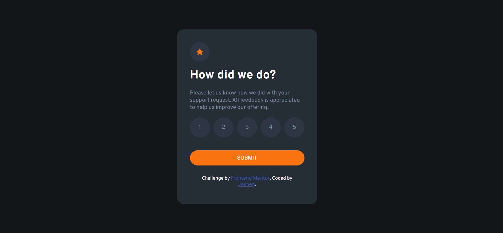
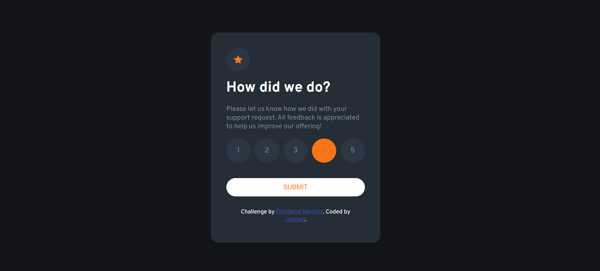
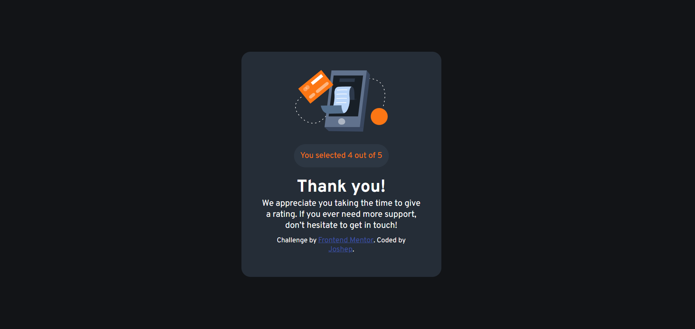
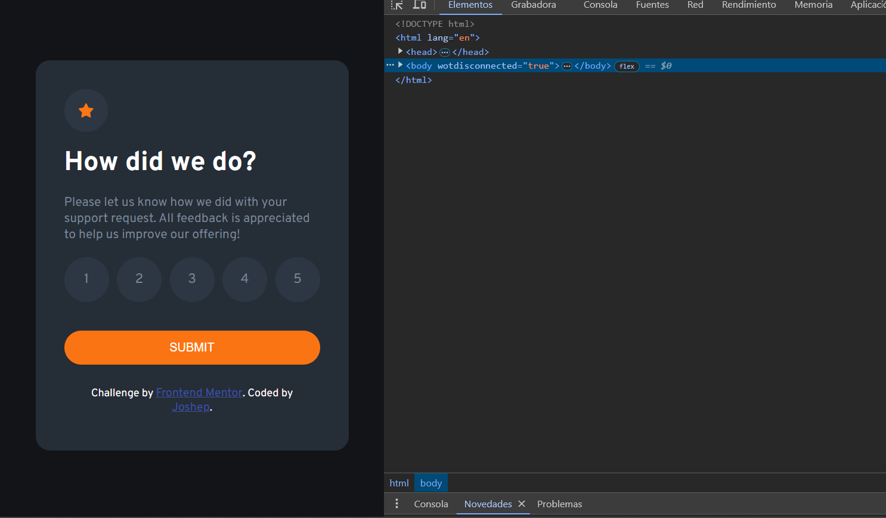

# Interactive Rating Component


## Descripción

Este proyecto es un componente interactivo de calificación diseñado como un reto de Frontend Mentor. Permite a los usuarios calificar una experiencia y recibir una confirmación de su calificación. El componente está diseñado para ser responsive y se adapta a diferentes tamaños de pantalla.

## Tecnologías Utilizadas

- **HTML**: Para la estructura de la página.
- **CSS**: Para el diseño y estilo del componente.
- **JavaScript**: Para la funcionalidad interactiva del componente.

## Estructura del Proyecto

- **`index.html`**: El archivo HTML principal que define la estructura del componente.
- **`style/main.css`**: El archivo CSS para el estilo del componente.
- **`app.js`**: El archivo JavaScript para la lógica interactiva del componente.
- **`images/`**: Carpeta que contiene las imágenes usadas en el componente.

## Funcionamiento

1. **Estado de Calificación**: 
   - Los usuarios pueden seleccionar una calificación entre 1 y 5 estrellas.
   - Una vez seleccionada una calificación, el usuario puede hacer clic en el botón "Submit" para enviar su calificación.

2. **Estado de Agradecimiento**: 
   - Después de enviar la calificación, el componente muestra un mensaje de agradecimiento junto con la calificación seleccionada.

## Cómo Ejecutar el Proyecto

1. **Clona el Repositorio**:
   ```bash
   git clone https://github.com/joseargentina/interactive-rating-component.git
   ```

2. **Navega al Directorio del Proyecto**:
   ```bash
   cd interactive-rating-component
   ```

3. **Abre `index.html` en tu Navegador**:
   - Puedes abrir el archivo `index.html` directamente en tu navegador para ver el componente en acción.

## Capturas de Pantalla

### Estado de Calificación


### Estado Activo



### Estado de Agradecimiento



### Versión Móvil



## Créditos

- **Solución**: [Ver solución](https://interactive-component-rating-dev.netlify.app/)
- **Desafío de**: [Frontend Mentor](https://www.frontendmentor.io?ref=challenge)
- **Desarrollado por**: [Joshep](https://github.com/joseargentina)
- **Frontend Mentor**: [Joshep](https://www.frontendmentor.io/profile/Joseargentina)


